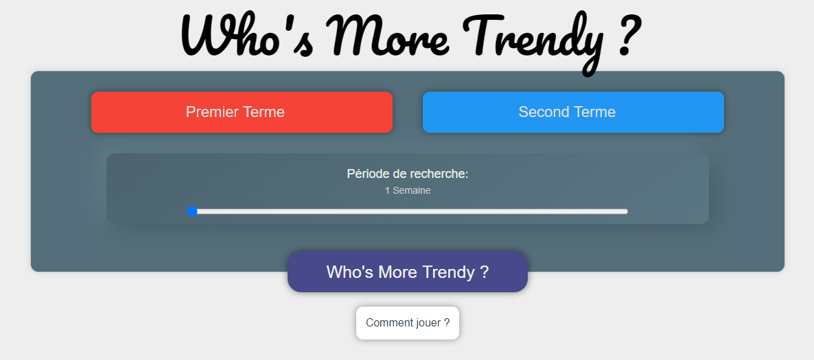
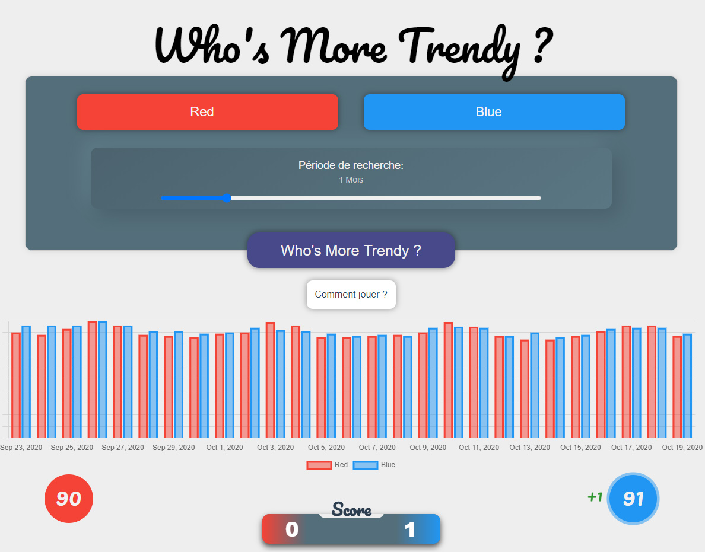
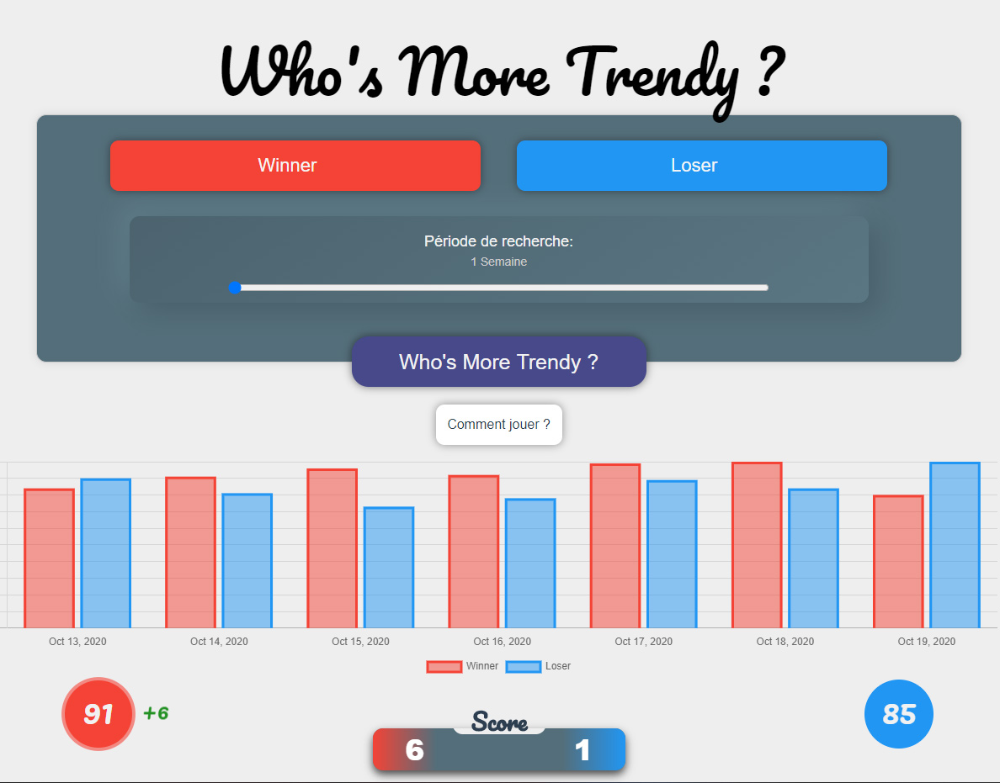

# Who's More Trendy ?



## Qu'est-ce que c'est ?

Il s'agit d'un jeu basé sur l'API de 📈Google Trends, développé avec le Framework Vue.js.
La version build est disponible à cette adresse: `insérer ici l'url`

Parfait pour décider de qui fera la vaisselle ce soir ! 🤷‍♀️🤦‍♂️👍

Je me suis librement inspiré de célèbres Youtubeurs français travaillants dans une 🟥Boîte Rouge🟥 pour ce projet 😎.

## Quelques screenshots:




## Compiles and hot-reloads for development

Si vous souhaitez fork le projet et le modifier, libre à vous. Un petit crédit serait tout de même apprécié, que ce soit dans votre code ou sur la page directement.

```
npm run serve
```
